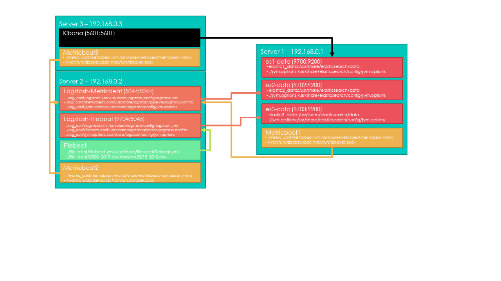

# Earthquake_ELK



## Introducción

Este proyecto utiliza información de [USGS](https://earthquake.usgs.gov/), específicamente su API para la recolección de los datos de terremotos de las últimas 2 décadas. 
También hacemos uso de docker y su herramienta compose para la ejecución del stack Elastic + Logstash + Kibana + Beats.

## Contenido
- Recomendaciones de uso
- ¿Cómo obtener los datos?
- Ejecución de los servidores
- Visualizar los datos
- Acceder a Kibana

### Recomendaciones de uso
- El sistema operativo utilizado fue Ubuntu 20.04 LTS, su uso fuera de este sistema operativo debería funcionar, pero no esta asegurado.
- Para hacer uso de este proyecto lo recomendado es utilizar 3 máquinas virtuales
- La máquina que ejecutará el Server 1 debe tener por lo menos 4GB de RAM, o modificar el jvm.options. 
- Para el server 2 se recomienda tener por lo menos 2GB de RAM.
- Para el server 3 por lo menos 1GB de RAM
- La salida de logstash se manda al servidor de elastic y a la pantalla, lo segundo puede desactivarse comentando (con el carácter #) o eliminando las líneas:
```
stdout { codec => rubydebug }
```
del [filebeat.conf](./Server2/log_conf/filebeat.conf) y [metricbeat.conf](./Server2/log_conf/metricbeat.conf)

### ¿Cómo obtener los datos?

Para obtener los datos del USGS se utilizará la función de solicitudes a la API del geológico, esta solo permite hacer solicitudes máximas de 20 mil datos, por lo que, si deseas hacer solicitudes, primero es recomendado hacer una petición count para saber cuántos datos empatan con tu solicitud. Más información de la API del geológico se puede encontrar [aquí](https://earthquake.usgs.gov/fdsnws/event/1/).

El método utilizado para recuperar los datos es un script de bash que hace solicitudes desde el año 2000 hasta el 2019, de 15 en 15 días asegurando que los datos solicitados son menores a 20 mil, cada archivo lo almacenará en una carpeta llamada querys, al finalizar el script mandará todo lo recuperado de la API a un archivo llamado 2000_2019.csv y borrará la carpeta querys.
El script se puede encontrar en este repositorio, [aquí](./Server2/file_conf/wget_all.sh).

Para ejecutar el script, desde una terminal bash ejecutar el comando: 
```
sh wget_all.sh
```
Puede tardar varios minutos hasta horas dependiendo de la velocidad de tu internet.

### Ejecución de los servidores
Antes de comenzar, deberas modificar los valores de IP de cada servidor a los de tus máquinas virtuales, los archivos que se deben modificar son:
- [metricbeat.yml](./Server1/metric_conf/metricbeat.yml) del servidor 1. La IP que debes ingresar es la de tu servidor 2 (Logstash).
- [filebeat.conf](./Server2/log_conf/filebeat.conf) del servidor 2. La IP que debes modificar es la del servidor 1 (Elastic), como requisito opcional puedes modificar el nombre del index, este debe ser en minúscula.
- [metricbeat.conf](./Server2/log_conf/metricbeat.conf) del servidor 2. Nuevamente, la IP que debes modificar es la del servidor 1 (Elastic), como requisito opcional puedes modificar el nombre del index, este debe ser en minúscula.
- [metricbeat.yml](./Server3/metric_conf/metricbeat.yml) del servidor 3. Debe cambiar la IP de host de Logstash por la de tu servidor 2.

Ahora ya podemos comenzar a levantar nuestros servidores, el comando que ejecutaremos en cada servidor es:
```
docker-compose up
```
Este comando debe ser utilizado en el directorio donde se encuentre el archivo docker-compose.yml.

Para la ejecución de los servidores, primero debemos poner en ejecución el cluster elastic que se encuentra en el Server1, a continuación, lo recomendado es seguir con el servidor de Kibana que es el Server 3, finalizando con el Server 2, que es el servidor Logstash.

Si todo está funcionando de manera correcta deberás ver en la salida de Logstash toda la información que va recibiendo. En caso de haber desactivado la salida a pantalla, podrás encontrar la información en Kibana.

Antes de comenzar con el procesamiento de información debes crear las plantillas de índices para indicarle a elastic como manejar los campos que recibirá, esto es importante si quieres tener geo point y utilizarlos en mapas.
Para crear la platilla, solo debes ir a la sección Dev Tools de Kibana, ahí pega lo que aparece [aquí](./index mappint.txt) en la ventana de consola. deberías recibir un mensaje de aceptado. Si modificaste el nombre del índice, recuerda modificarlo aquí también.


### Acceder a Kibana
Para visualizar los datos, deberás acceder a la IP del servidor Kibana en tu buscador, en el puerto 5601. Ejemplo:
```
192.168.0.2:5601
```
Si todo arrancó de manera correcta ingresaras al panel de visualización de Kibana, en el menú lateral, en la sección management, selecciona Dev Tools, te llevará a una ventana con un comando GET. Ingresa el siguiente comando:
```
GET _cat/indices/
```
Aquí verás todos los índices que contiene tu cluster de Elastic. Recuerda el nombre del índice ya que lo usaremos más adelante.

### Visualizar los datos
Ve a la opción Discover de la sección Kibana, aquí deberás crear un patrón de índice, puedes utilizar el mismo nombre del índice que vimos en la sección anterior, o acortar el nombre. Kibana te avisará de las coincidencias con ese nombre. En la siguiente ventana selecciona @timestamp, ya que se ha configurado la fecha de los eventos en @timestamp. Al finalizar verás la cantidad de “hits” que lleva tu índice, si no ves los valores, incrementa tu rango de búsqueda ya que tenemos fechas desde el año 2000.

De aquí puedes crear tus propias visualizaciones con los datos.
